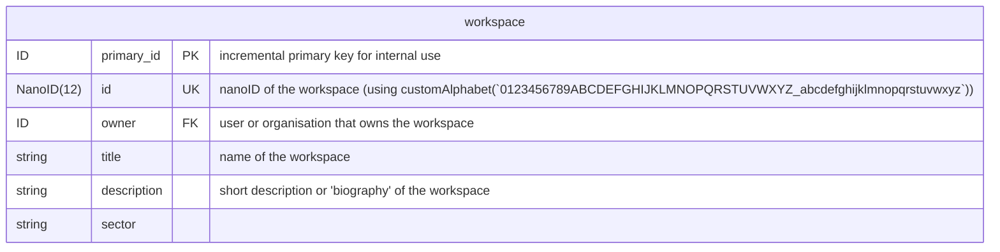

---
title:
authors:
description:
created: 2025-10-24T12:07:50+02:00
modified: 2025-10-24T12:07:55+02:00
license:
license_url:
---

Workspaces, otherwise known as Projects are publishing entities. This can mean an artist, a label, a press writer, or otherwise. These are separate from user logins, similar to how YouTube handles Google Accounts and YouTube Channels, where the Channel is the equivalent of a Workspace.

