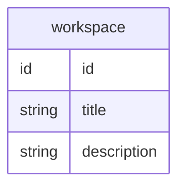

Erato is our backend app.

We use Prisma ORM to be able to run Erato on different platforms without having to write our own adapters.

## Model

workos

- users (login)
- orgs

---

vesta

- [[workspaces]] (artist / label profiles) - projects
- artifact (post)
- permissions (subject - object - permission)
    - workspace
    - artifact
    - org
- roles / teams

