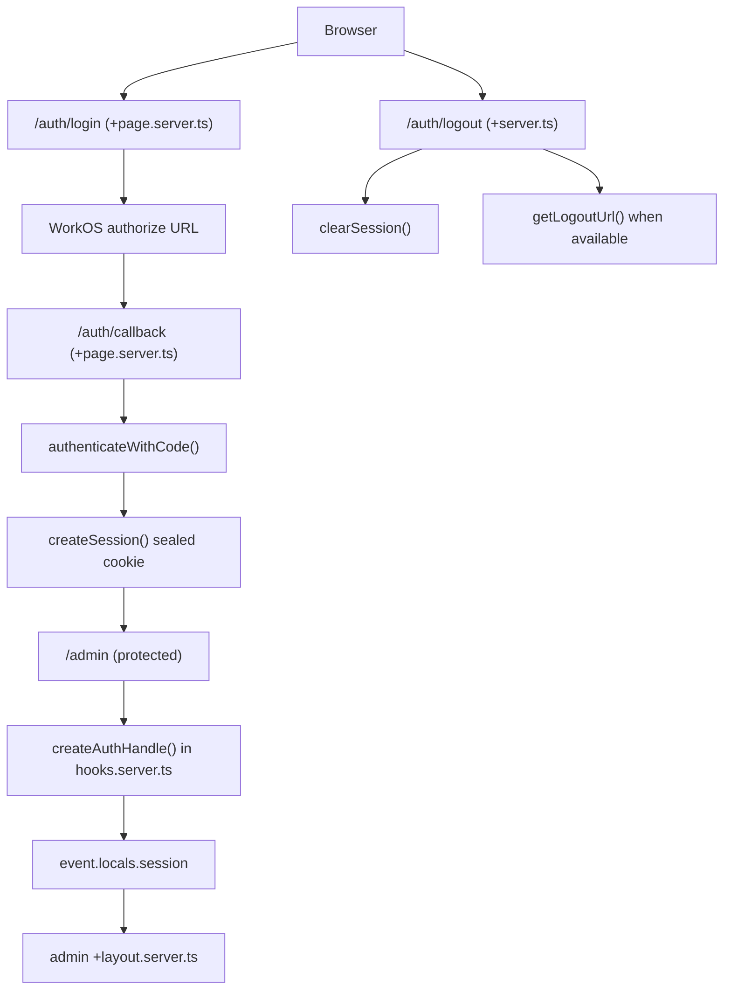

# Auth Flow (How, Why, Implementation)

This document explains how authentication works in vesta today using `@vesta-cx/utils/auth`, starting at a high level and then moving into implementation details.

## High-Level Overview (How + Why)

vesta uses a **hybrid auth pattern**:

1. **Auth routes** handle provider protocol steps
   - `/auth/login` starts WorkOS authorization
   - `/auth/callback` exchanges code for tokens/session
   - `/auth/logout` clears local session and ends provider session
2. **SvelteKit hook (`createAuthHandle`)** handles request-wide policy
   - Hydrates `event.locals.session` from cookie
   - Enforces auth on configured protected paths
   - Redirects unauthenticated requests to login

### Why this split is preferred

- OAuth/OIDC-like flows are inherently route-driven (redirect in/out of app)
- Session hydration and protected-route checks are cross-cutting concerns, best centralized in `hooks.server.ts`
- This avoids duplicate session checks across every protected route/layout
- App-specific behavior stays configurable (`protectedPaths`, `loginPath`, `cookieName`) without duplicating auth internals

## Architecture at a Glance

## Package File Map

These docs mirror `packages/utils/src/auth` file structure:

- `index.ts` → [`index-api.md`](./index-api.md)
- `types.ts` → [`types.md`](./types.md)
- `session.ts` → [`session.md`](./session.md)
- `workos.ts` → [`workos.md`](./workos.md)
- `handle.ts` → [`handle.md`](./handle.md)

## App Integration Pattern

`apps/sona` is the reference app for current usage:

- `src/hooks.server.ts`
  - Composes `createAuthHandle(...)` into the app handle chain
- `src/routes/(app)/auth/login/+page.server.ts`
  - If session exists, redirect to `/admin`; otherwise redirect to WorkOS auth URL
- `src/routes/(app)/auth/callback/+page.server.ts`
  - Validate `code`, exchange via WorkOS, create session cookie, redirect to `/admin`
- `src/routes/(app)/auth/logout/+server.ts`
  - Attempt WorkOS logout URL using current access token, always clear local cookie, redirect
- `src/routes/(app)/admin/+layout.server.ts`
  - Reads hydrated `locals.session` for protected UI data

## Flow Branches Worth Watching (for DRY work)

These branches are where duplicate logic tends to appear across apps:

- Platform/env available vs unavailable
- Cookie present/valid vs absent/invalid
- Protected path vs public path
- WorkOS code exchange success vs failure
- WorkOS logout URL derivable vs fallback logout

If refactoring for DRY, target shared helpers around env resolution, session hydration, and callback session mapping first.

## See Also

- [WorkOS Auth Setup](../workos-auth-setup.md)
- [Development Checklist (Phase 1)](../../../Projects/vesta/development-checklist.md)
