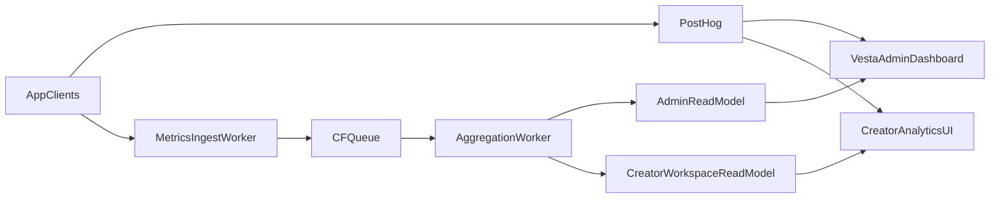

# Usage Metrics & Analytics Roadmap

## Goal

Ship analytics in phases without blocking product delivery:

- **Near term:** PostHog-first for fast instrumentation and dashboards
- **Later:** In-house pipeline for cost control, ownership, and custom analytics models

This roadmap separates two products:

- **Internal usage metrics** (global, app-wide, admin-facing)
- **User-facing analytics** (creator/workspace/org-facing)

## Scope Boundaries

### Internal usage metrics (vesta admin)

- Platform adoption: DAU/WAU/MAU, active creators, active workspaces, active orgs
- Product usage: top routes/actions, creation/editing velocity, retention snapshots
- Pipeline health: ingest volume, dropped events, lag, dashboard freshness
- Safety and quality: abuse-report rates, moderation queue pressure, policy-hit trends

### User-facing analytics

- Creator profile metrics: views, unique visitors, link clicks, CTR
- Resource metrics: post-level views and engagement trend deltas
- Workspace metrics: 7-day/30-day rollups and top content
- Org metrics: rollup across all workspaces in an org with per-workspace drill-down

## MVP (Milestone 2): PostHog-first

### Delivery defaults

- Use PostHog for event ingestion, exploration, and first dashboards
- Keep a canonical event taxonomy independent of vendor naming
- Ship read-only analytics UI for:
  - creator/workspace views
  - org-admin rollups
  - internal vesta-admin overview

### Event model conventions

- Immutable event stream with append-only writes
- Explicit action events for state transitions:
  - `engagement.like_added`
  - `engagement.like_removed`
- Context fields on every event:
  - actor (`user_id`)
  - scope (`workspace_id`, `org_id`)
  - subject/object (`resource_id`, `resource_type`)
  - source (`vesta-web`, `erato-api`, `sona`)
  - timestamps (`occurred_at`, `ingested_at`)

### Access boundaries

- Creator: own profile/workspace analytics only
- Org admin: org-wide rollups + workspace drill-down
- Platform admin: global cross-org analytics

## Migration Path: PostHog -> In-house

### Trigger conditions

- Cost and retention constraints
- Query flexibility limits
- Data ownership/residency requirements
- Latency/SLO requirements for internal dashboards

### Migration phases

1. **Taxonomy hardening**
   - Freeze event names and required properties
2. **Dual-write**
   - Send events to PostHog and in-house ingest
3. **Parity validation**
   - Validate key metrics match within agreed thresholds
4. **Primary switch**
   - Move admin and user-facing read models to in-house aggregates
5. **PostHog role narrowing**
   - Keep for exploration/replay/experiments as needed

## Very Late Stage: Semantic Analysis & Algorithmic Collections

### Prerequisites

- Large, clean historical interaction dataset
- Stable event taxonomy and identity resolution
- User controls in product:
  - block user/workspace/collection
  - not-interested for genres/topics
- Moderation and policy guardrails for ranking systems

### Capability roadmap

1. **Behavioral ranking (pre-semantic)**
   - Recency, engagement quality, creator affinity, workspace affinity
2. **Semantic indexing**
   - Topic/genre embeddings for posts/resources/statuses
3. **Blended ranking**
   - Behavioral + semantic + explicit preference controls
4. **Evolution-aware personalization**
   - Detect preference drift and adapt over time windows

### Non-negotiable guardrails

- Explicit user controls always override algorithmic recommendations
- Explainability metadata for why content appears
- Staged rollout with quality/safety evaluation gates

## Architecture Sketch

## See Also

- [Milestone 1 Roadmap](./milestones.md)
- [Feature Catalog & Pricing Transparency](./feature-catalog.md)
- [Feature Access & Gating](./feature-access-gating.md)
